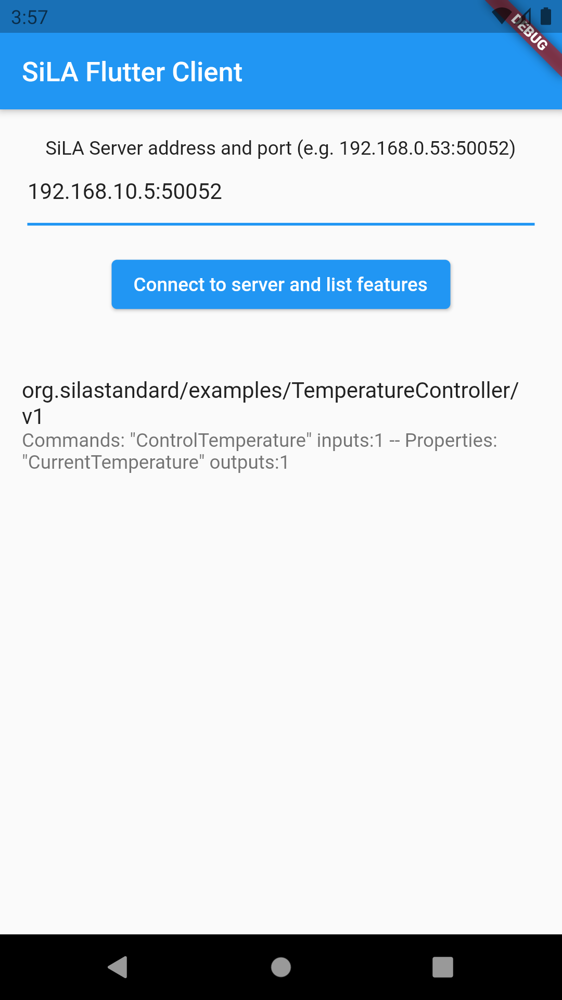
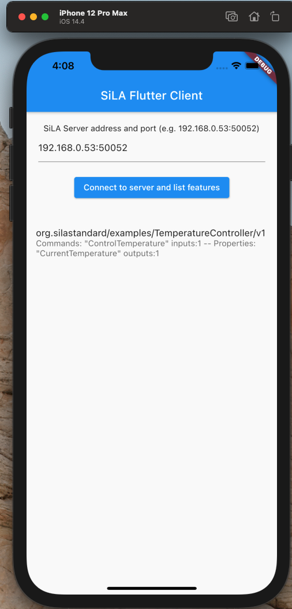
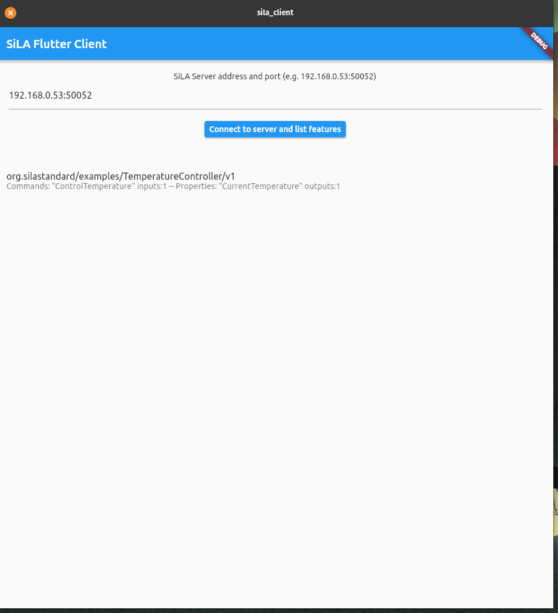
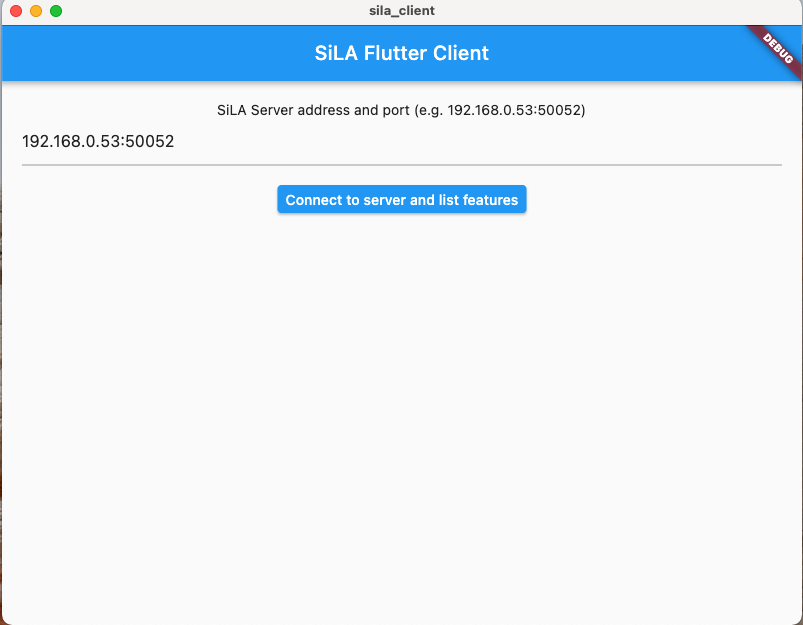
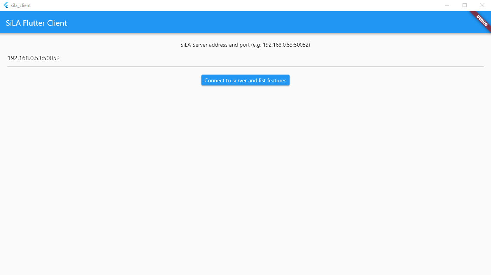

# SiLA_Generic_Client

## Intro

We aim to develop a generic SiLA client capable of SiLA server-client communication without the use of additional pre-generated stubs enabling simpler and quicker interaction with SiLA Servers and Devices

Through the use Flutter Framework a multi-platform client should be achievable, capable of running on mobile devices, desktop machines or as a web application

This project does not require the use of external tooling such a code generator or protoc, it aims to generate the required gRPC/Protobuf internally using queried Feature Definitions, because of this the client is self contained and should not require any external software to be run

A prototype client is currently under development and is capable of querying SiLA Servers and building the required messages to make calls using several basic SiLA types to Properties and Commands

## Screenshots

### Mobile 

Left to right Android, iOS
<p float="left">


</p>

### Desktop 

Left to right Linux, MacOS, Windows
<p float="left">



</p>

## Installation 

### Requirements

- Flutter (https://flutter.dev)

- Android Studio (https://developer.android.com/studio) 
  - Setup plugins for Flutter/Dart
  - Setup emulator if physical device is unavailable
  
- SiLA Example Servers
  - Initial testing done using the Java and Python Examples
    - https://gitlab.com/SiLA2/sila_python (ObservableProperty, ObservableCommand)
    - https://gitlab.com/SiLA2/sila_java (HelloWorld)

### Setup and Running

- Setup SiLA Example Server and note down IP (localhost if on same machine)

- Clone the repo `git clone https://github.com/applied-scientific-technologies/SiLA_Generic_Client.git`
- Open the project in Android Studio
- Ensure a device on emulator is connected and press Run

- Enter Server IP/Port, if no self-signed certificate is being used uncheck the secure connection checkbox (Python Demo Server)
- Press connect and the client will attempt to connect to the server and display found features

- Three test buttons are also present, each will attempt to send a preconfigured command to the Server
  - **The correct Server must be running for the preset command buttons to work**
  - **TestHello -> Java HelloWorld Example**
  - **TestOProp -> Python Observable Property Example**
  - **TestOCmd -> Python Observable Command Example**

- Responses from successful commands will be displayed in the output box, e.g.

```
Greeting: {
   value: Hello Joe
}
StartYear: {
   value: 2021
}
```
 
  
### Calling Different Commands

This is currently fairly clunky as no GUI mappings are in place, once the client connects to a server it builds a `Feature` object for every Feature Definition returned
by the server. The client holds these feature objects in a list [Feature_1, Feature_2, Feature_N] and each Feature holds Command/Property objects which are determined during 
the parsing of the definition.

To call a command or property the ID (index) of the feature it's contained in must be found and then the ID (index) of the property, at present the easiest way to do this is to
insert a breakpoint after the client has connected and examine the features and inspect the commands and their expected inputs


For example the HelloWorld server provides a `GreetingProvider` feature, within this feature is the `SayHello` command which takes a string as input and outputs a string

In the client the `GreetingProvider` is stored as Feature 0 and the `SayHello` command as Command 0

So this command can be called by using the `callCommand()` function and passing in the Feature Index, Command Index and a list of parameter values

`await _client.callCommand(0,0,["Testing"]);`

This will call the command return a generic message containing the string output

Similar calls are also implemented for properties and observables, subscribing commands will return a stream which can be listened to for incoming responses rather than a single response message

*Note that only a few of the basic types are supported at present so commands requiring more complex parameters will not yet work (Lists / Structs / etc)*


# Todos / Notes

Notes around work packages outlined in proposal request

### Universal Client, installed locally or deployed in cloud
  - Front end should be platform independent, pref web app

*Should be covered by Flutter's cross platform capabilities*

### Server management
  - Add / Remove
  - List Features
  - Discovery supported

*We have looked into discovery already in DEFT so should carry over, Listing Features is do-able as we already request Definitions*
*Adding / Removing servers manually is fairly basic user input*  


### Command Execution
  - Parameter Input
  - Display Responses
  - Intermediate Command Responses (Observable Commands)
  - Handle SiLA Basic Types + SiLA Derived Types
  - Handle Unit Constraints 

*Initial testing has shown commands can be executed, both observable and unobservable*
*Responses are correctly rebuilt, intermediate responses are also handled*
*Currently only supports a couple basic types, further investigation to do regarding Derived types (Structs, Lists)*
*Unit constraints can be parsed from the FDL and handled at Client front end on user inputs*

### Property Handling
  - Observable 
  - Unobservable

*Initial testing has shown properties can be executed, observable and unobservable*
*Responses are correctly rebuilt*
*Current support for only a couple basic types, further work to be done here*

### Support server-initiated connection method

*Potentially this is a lot of work, from initial understanding a SiLA Server would need to be hosted on the device*
*alongside the client, currently there is no Dart implementation of a SiLA Server*

### Support core Features from sila standard core 

*We will have the stubs for these so shouldn't too difficult to wrap into GUI*

### Support SiLA Client Meta Data, plug in mechanism?

*Further research needed on what this entails*

### Error Handling
  - Validation
  - Execution
  - Framework
  - Connection

*Further work to be done here, looks like SiLA errors build on top of gRPC Errors*
*Should also have the stubs for these types too*

### Testing / Documention Meetings

*Should be ongoing during development*
